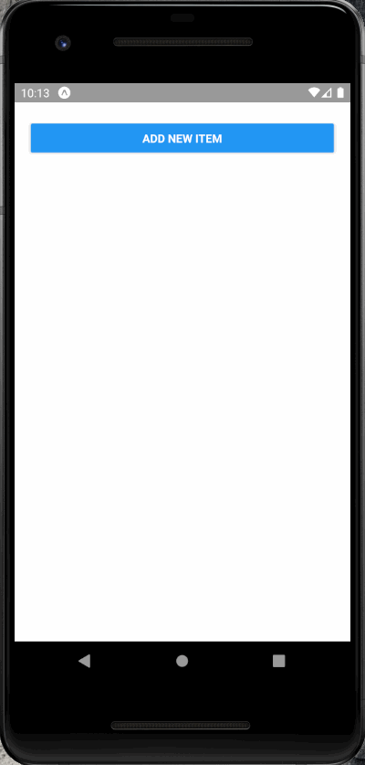

# Item List Manager
> Very simple application, manages items in a list

I created this app following [Maximilian Schwarzmüller](https://www.udemy.com/user/academind/)'s course: [React Native - The Practical Guide](https://www.udemy.com/react-native-the-practical-guide/)

## Built With

* [Expo](https://expo.io/)
* [React Native](https://facebook.github.io/react-native/)
* [Flexbox](https://facebook.github.io/react-native/docs/flexbox)

## Demo

## Meta

Gustavo Máximo – gfmaximo97@gmail.com